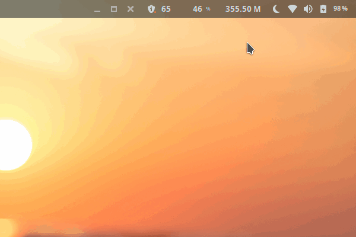

# gnome-shell-extension-net-usage

Easily see your data usage collected by vnstat from the gnome-shell

## RoadMap

#### This app is still a work in progress

Below are the things needed to be integrated before the first version can be usable.
*Though you can still use it by hard coding your device interface on the source code. and installing vnstat manually*

**Todos**
- :heavy_check_mark: Update extension label of the current day data usage
- :heavy_check_mark: Create a modal with data usage on other days (Today, Yesterday, This month)
- :heavy_check_mark: Modal is shown upon clicking of the extension
- :heavy_check_mark: Create update script on root project to copy folder to local user gnome extensions folder
- Add a settings to configure interface to watch
- Add a setting to change color scheme
- Handle error if no vnstat is installed on the system, Make sure to give user instruction on how to install vnstat
- Documentation
